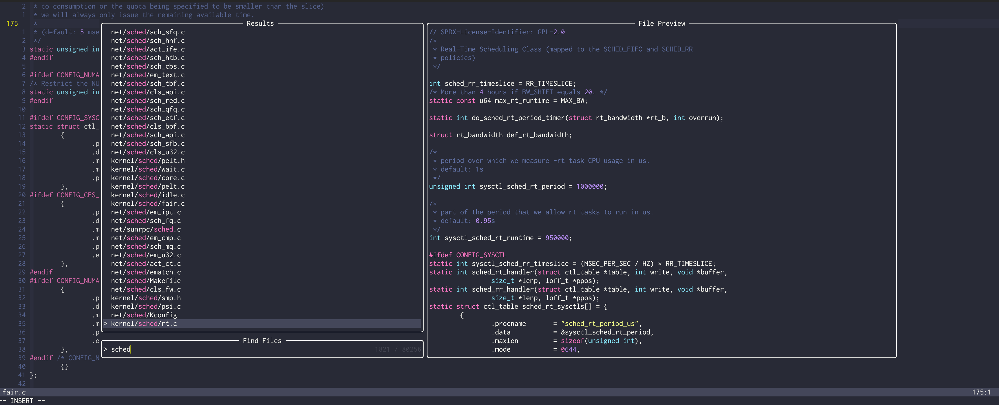
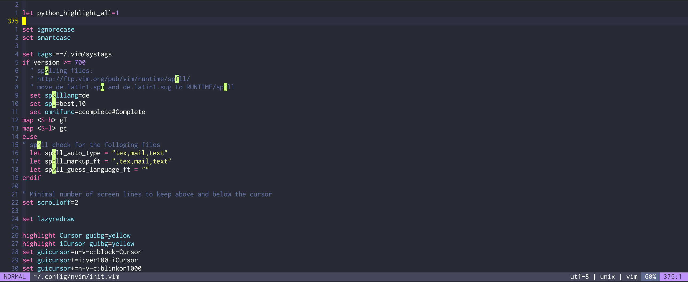
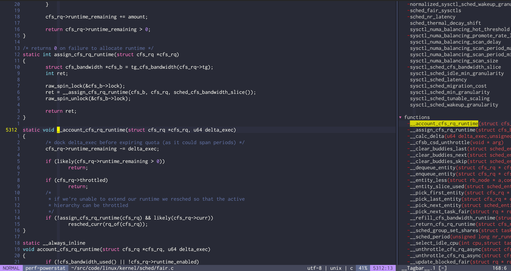

**tl;dr:** *for 25 years standard vim user, without plugins. Since two years
questioned bad habits and analyzed repetitive pattern and switched to neovim
with certain plugin set.  Here I describe which plugins I use and why*.

Admittedly, I don't get to do much programming. Usually it's analyses using
Python or minimal code here and there, which I create in the the evening hours.
Sometimes hardware-related C or Rust code. But it's by no means the case that
I'm constantly contributing code to larger software projects and programming
24/7. The daily work routine takes its toll. Nevertheless, I still try to
create a balance in my free time in order to to devote myself to highly
technical, cutting edge technologies. 

I've been using vim as an editor since I started using Linux, which was almost
25 years ago. I used to use Emacs and at work I also came into contact with
Sublime Text - which is a great editor (vim under Windows was never really my
favourite). Since I usually never code at work programming at work, I have no
need for an editor under windows. My statements therefore refer entirely to the
Linux environment.

Since then I have been using vim, on principle, without plugins, to be as
flexible as possible without accumulating large digital debts or developing too
far away from standard vim.

Of course, I've been following all the neovim trends and the many new command
line tools, often developed in Rust. Where I have actually renewed myself with
the command line tools by using new tools, I have not changed my vim habits. I
just had the feeling that I could work very efficiently with my editor.

Over the last two years, however, I've started to try out new things, to
question bad habits, to look specifically at where my workflow can be improved,
where repetitive patterns are hidden and so on.

Well, and what can I say, for 2 years I have actually been using neovim with a
number of plugins and I would like to introduce them here together with my
workflow. Here is a first screenshot:


About my basic way of working: I usually have a vim open and navigate in this
vim (`:e`). I never close this vim. For smaller projects I suspend vim with
`CTRL-Z`, for example to execute the modified script. Then I switch back to
foreground mode with `fg` and continue editing. My edit execute cycle for small
projects.

For larger projects I use several terminals (currently Kitty, but this is not
so relevant). In terminal 1 I use vim all the time without suspending. In the
remaining terminals I run the scripts, generate images, compile, use git, and
so on.

You can also see from the usage that large IDEs such as Microsoft Visual Studio
Code do not fit into my working scheme. I use lean editors and quickly open a
file on the command line - VSCode would not fit here. For others, VSCode is
perfect, for my Unix philosophy way of working ("Make each program do one thing
well").

## Fundamentals

- Speed is important to me. Any plugin that takes a long time to load is de
  facto ruled out. I open many files and often in new vim instances when I
  navigate through the file system. Speed is king
- Large files must be loaded just as quickly as standard vim. I avoid plugins
  that slow down this process.
- I try to keep the plugins to a minimum. Things rot and the more plugins the
  more debt - that's the way it is with software.  I want to be efficient and
  not replace broken plugins every 6 months. 


## What I Use and Why - Plugins

### Plugin Manager - Plug

Don't remember anymore why I use [Plug](https://github.com/junegunn/vim-plug).
Nowadays I would use lazy or packer. Anyway, Plug works since day 1 without any
problems - great. E.g. to update all plugins a simple `:PlugUpdate` is all.

### Colorscheme Dracula

I use [Dracula](https://github.com/dracula/vim?tab=readme-ov-file) as the color
scheme. The dark aesthetic paired with a little modern purple - I like it that
way.  For a comprehensive list colorschemes of available see
[this page](https://linovox.com/the-best-color-schemes-for-neovim-nvim/).


### Telescope

[Telescope](https://github.com/nvim-telescope/telescope.nvim) is a fuzzy finder
for lists. These lists can be of different sources. For example, the list of
recently opened files or the file list of a directory, and so on. Telescope is
directly hooked up to Neovim and uses a lot of infrastructure to display these
lists efficiently and visually appealing.

Additional plugins can be used to display additional lists.

The following image show `find-files` picker to select and open new files. With
enter the current buffer is replaced, with `CTRL-x` the file is opened in a new
split view. But there are many more option how to deal with telescope.



### Editorconfig

Some projects use [editorconf}(https://editorconfig.org/) files to specify
standardized formatting. In a generalized way. In order for this to be
processed by vim neovim, a plugin is necessary. The standard Plugin is
[editorconfig-vim](https://github.com/editorconfig/editorconfig-vim). For
example, the following elements for example are supported: `indent_style`,
`indent_size`, `tab_width`, `end_of_line`, `charset`, `insert_final_newline`.

### Leap

Is a general movement plugin. This makes it possible to reach almost any area
on the screen with a maximum of 3 buttons. For this I use
[leap](https://github.com/ggandor/leap.nvim).

In the image you see the highlighed movement marks, after I started to "define"
my next jump destination:



### Lualine


[nvim-lualine](https://github.com/nvim-lualine/lualine.nvim) a reasonably fast
statusline plugin that allows you to configure the most important information
in a simple way.


### Tagbar

Provides a toggleable browser of tags in the current file. Great to get an
overview over the scructure of a file (functions) and to jump to them without
using a language server. Here see the tagbar on the right hand side for a open kernel file:

[](tagbar.png)

The project, can be found
[majutsushi/tagbar](https://github.com/preservim/tagbar).

### Shade

A configurable shading plugin that shades (reduce the color) for inactive
windows. Makes is more user friendly where you are. Projecthomepage at
[sunjon/shade.nvim](https://github.com/sunjon/Shade.nvim).

Here on the left the active window, right is the inactive window. The shading
effect is configured in a light way, so that reading on the shaded window is
still possible without problems.


### Gitsigns

Displays git repository modifications nicely. This is helpful for navigation,
because you can visually see where you have already changed something. The
script loads the Git status fast and lazy, so that this also works great in
large repos like kernel and so on.

You can see this in the screenshot with the green line on the left-hand side:


The project homepage is
[lewis6991/gitsigns.nvim](https://github.com/lewis6991/gitsigns.nvim).

## What I NOT Use and Why 

- No deep Git integration! I love the flexibility of Git and the possibilities
  on the command line.  Fugitive, Lazygit and co, just have too much overhead
  for me, I know my way around Git, rebase, sqash, view log and often use
  special options, I don't see the benefit of controlling this from Vim.
- I don't use Language Server integration (LSP), it might have advantages for
  completion or warning messages, but at the moment I'm still happy without it.
  That would be an enhancement for the future. Let's see!
- No ChatGPT, Llama, or other LLM integration, I use the browser chat or use
  custom scripts via the OpenAI API to interact with LLMs for now. Lets see how
  this work out.
- No additional marker plugin, like Harpoon. I like the idea but automatic
  jump-marks as well as frequent changing files makes it for me a little bit
  senseless. The `oldfiles` list in combination with telescope works out for me!
- No file manager, just the build-in functionality and fuzzy finder telescope
  file management.
- No session management. Just lack of longer standing session where the
  "overhead" make sense.
- No startup dashboard like startify, I usually start vim with an file argument
  (so open a file) or instantly open telescope to open a file. No need for an
  additional interruption beforehand.
- No note-taking plugin like obsidian or vim orgmode clones. Just no need for this.
- No terminal integration, no tmux bridge, nothing
- No commenting plugin, do not work for me (I don't write comments! ;-))

There are a ton of great plugins. A comprehensive list of plugins for neovim
can be found here:
[awesome-neovim](https://github.com/rockerBOO/awesome-neovim?tab=readme-ov-file).


## Keybindings

It makes no sense to copy my whole vim configuration here. I just want to
highlight some of the more important option here. The posted keybindings are
often in vim syntax, I have not yet converted them to Lua.


### Leader

I use the space bar as a leader. Why? Because it is the key that is quickest to
reach and I always hit it. It is also not occupied.

```
vim.keymap.set("n", "<Space>", "<Nop>", { silent = true, remap = false })
vim.g.mapleader = " "
```

### Leap Motion

Navigating via leap is great, for this I configured the most easy typeable keys to this event:

- `<SPACE>` followed by `<SPACE>` command a forward search
- `<SPACE>` followed by `<ESC>` command a backward (op top) search

My keybindings:

```
vim.api.nvim_set_keymap('n', '<leader><space>', '<Plug>(leap-forward)', {})
vim.api.nvim_set_keymap('x', '<leader><space>', '<Plug>(leap-forward)', {})
vim.api.nvim_set_keymap('o', '<leader><space>', '<Plug>(leap-forward)', {})
vim.api.nvim_set_keymap('n', '<leader><esc>', '<Plug>(leap-backward)', {})
vim.api.nvim_set_keymap('x', '<leader><esc>', '<Plug>(leap-backward)', {})
vim.api.nvim_set_keymap('o', '<leader><esc>', '<Plug>(leap-backward)', {})
```

### Copy & Paste

```vim
" Copy to clipboard
vnoremap  <leader>y  "+y

" Paste from clipboard
nnoremap <leader>p "+p
```

### Colorscheme Tweaks

I never ever want to see italic fonts!

```vim
let g:dracula_italic=0
colorscheme dracula
```

### Oldfiles Buffer Size

My workflow is somehow based on the oldfiles list, to increase the size of the list the following option is set:

```vim
" 500 maximum number of oldfiles
" 50 maximum number of lines for each register
" 500 size of the saved command-line history
set viminfo='500,<50,s500,h,%
```

### Relative Line Number

This option makes sense: show always the current linenumber but also show the
just info to allow a quick navigation. Relative line number: on since many years!

```vim
set relativenumber
```

### Highlighting Things

```vim
nnoremap <silent> * :let @/='\<'.expand('<cword>').'\>'<CR>:set hls<CR>
nnoremap <silent> # :let @/='\<'.expand('<cword>').'\>'<CR>:set hls<CR>
```

### Spelling

I write english or write. To enable spellchecking I press F7 to toggle between
the languages and toggle checking off - and so on.

```vim
let g:myLang = 0
let g:myLangList = [ "nospell", "de_de", "en_us" ]
function! MySpellLang()
let g:myLang = g:myLang + 1
if g:myLang >= len(g:myLangList) | let g:myLang = 0 | endif
if g:myLang == 0 | set nospell | endif
if g:myLang == 1 | setlocal spell spelllang=de_de | endif
if g:myLang == 2 | setlocal spell spelllang=en_us | endif
echo "language:" g:myLangList[g:myLang]
endf

map <F7> :call MySpellLang()<CR>
imap <F7> <C-o>:call MySpellLang()<CR>
```

### Undo Levels

It makes no sense to limit the undo levels. I set to 1000, which is enough for me.

```vim
set undolevels=1000
```

### Autocmd and Filetype specific Option

I configured a lot if filetype specific options like add same line warning
(colorcolumn) for git commit messages. Or doing special things if writing
emails. See the following examples:

```vim
  autocmd FileType gitcommit
         \ set spelllang=en ff=unix cc=50,72 textwidth=90 expandtab
         \ nocindent
  autocmd FileType mail
         \ set spelllang=de formatoptions+=t textwidth=78 nocindent
         \ dictionary=/usr/share/dict/words
```

### Configure important (often used) Commands to Function Keys

```vim
nmap <F1> :Telescope oldfiles<CR>
imap <F1> <C-o>:Telescope oldfiles<CR>

nmap <F2> :Telescope find_files<CR>
imap <F2> <C-o>:Telescope find_files<CR>

nmap <F3> :lua require'telescope.builtin'.find_files({cwd = vim.fn.expand("~")})<CR>
imap <F3> :lua require'telescope.builtin'.find_files({cwd = vim.fn.expand("~")})<CR>

nmap <F4> :Telescope live_grep<CR>
imap <F4> <C-o>:Telescope live_grep<CR>

nmap <F5> :TagbarToggle<CR>
imap <F5> <C-o>:TagbarToggle<CR>

nmap <F6> :Telescope file_browser<CR>
imap <F6> <C-o>:Telescope file_browser<CR>

map <F7> :call MySpellLang()<CR>
imap <F7> <C-o>:call MySpellLang()<CR> 

nmap <F9> :Telescope marks<CR>
imap <F9> <C-o>:Telescope marks<CR>
```

## Closing

I hope the explanations were helpful! If you have any questions email to me.

All my dotfiles can be found at
[Github.com/hgn](https://github.com/hgn/dotfiles)!


> This blog post is admittedly a tech test for Hugo's skills (bundles, open
> graph, image processing, markdown dialect, syntax highlighting, ...), but I
> hope it's still helpful for some of you! ;)
