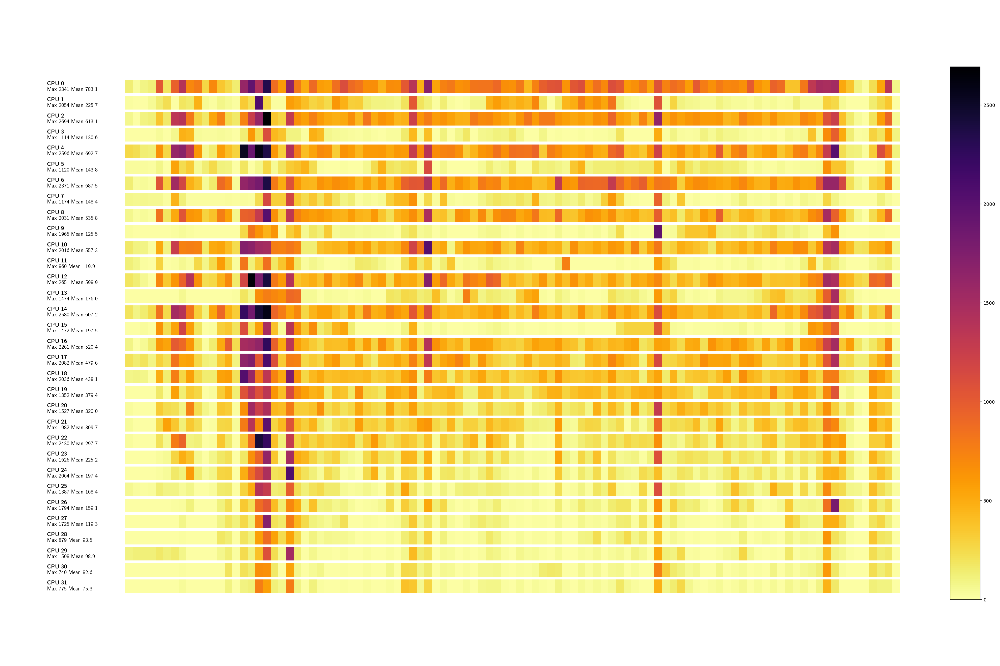

## Introduction

> **Note:** this article is part of a list of related articles. All of them are
> about the Perf Power Management Analyzer
> - Part 1: Introduction - overview and basic usage (**this document**)
> - Part 2: Timer Module - Analyze timer relevant information
> - Part 3: Governor Module - Possibilities for Governor analysis.

The perf power analyzer try to fill the gap between applications like
powertop who provides high level insights about power management and a raw
tracepoint/kprobes based analysis to find the "power hogs". Where the former,
powertop based analysis provides an rough first glimpse of where power is
consumed, the later provides detailed information for the developer to optimize
the system. The perf power analyzer eliminates a large part of the development
required to discover the causes of inefficient power management practices. It
also points to the causes, even if the upcoming experts do not yet have the
necessary detailed knowledge. 

The following "hello world" illustration shows one of the many analysis
provided by perf power analyzer. Here, for example, task (userspace and kernel)
wakeups per CPU core of an 32 core system are visualized. This analysis
provides important information about the CPU utilization per core. This is one
of many analyses that are available and explained in great detail in the
article series.

[](cover.png)

Perf power analyzer extract the most relevant power management data from the
kernel and process them module-specific. Additionally, the data created is
explicitly designed to be passed on to further specialized analysis scripts in
order to obtain more detailed and graphical analyses. Nevertheless, the
majority of modules already provide a very detailed insight, just by looking at
them, without you having to go any deeper. Many in-kernel details are
abstracted away and simultanously provides the raw data for further analysis.

Some analyses at this level require a deep understanding of the Linux Kernel
and its processes - unfortunately, the script cannot compensate for this.

This documentation try to explain the functionality of the perf power analyzer
script, the outputed data and how the data can be interpreted to help the
reader to do their own power management analysis. Furthermore, this
documentation provides a lot of post-processing scripts to further analyse the
data provided by the kernel and the perf power statistics script. These
post-processing scripts are not bundled with perf and will be hosted and maintained at
[github.com/hgn/perf-power-statistics-doc](https://github.com/hgn/perf-power-statistics-doc).
To generate these charts for your particular use cases, often just two commands
are required. How post-processing is is done is part of this article series.

## General Information

The Perf Power Analyzer uses a large number of tracepoints as a data source,
interprets and evaluates them. This is the technical foundation of the script.
The Perf power analyzer focuses on power management aspects that occur in the
CPU core. Properties of the processor uncore, GPU, NPU or other peripherals are
not in focus and are therefore not covered by this tool.

Perf power-statistics provide the functionality via so called modules. Each
module focus on one particular analyze and can be called separately.

Supported modules are:

- summary
- idle-cluster
- task
- timer
- frequency
- all (not a real module, it just enabling all other modules)

Based on this, each module often output several different analysis. For
example, the timer module provide information about timer type-callback
characteristics as well as time series of all expired timers. These different
outputs are called analyzer.

## Hello World

## Recording

## Extended Output

## Post-Processing

## CPU Filtering

## Kernel Function Name Mapping

Some analysis benefits from providing the function name instead of illustrating
the raw kernel address - or even requires this translation. For example: in the
timer analysis the internal callback functions are recorded. But addresses like
`ffffffffb6da37c0` are not that helpful for the user or post-processing. To map
these kernel addresses to function names a generic mapping script is provided
in the assets directory. This script simple iterates over `STDOUT` replaces all
matches with the function name - here `tick_sched_timer` - and print out
everything else untouched to `STDOUT`.

### Usage

```bash
# read from file and pipe to temporary file
$ sudo assets/kallsyms-mapper.py <timer-type-callback-expiration-bar.txt >tmp.txt
# overwrite input file with new mapping
$ mv tmp.txt timer-type-callback-expiration-bar.txt
```

If the script is not executed with effective UID 0 a warning is printed on `STDERR`.

> **Note:** the replacement must be done on the recording systems to recording
> time. Especially on systems with activated Kernel Address Space Layout
> Randomization (KASLR) where positions of kernel code is pseudo-randomized at
> boot time.

## Modules - Sneak Peak

