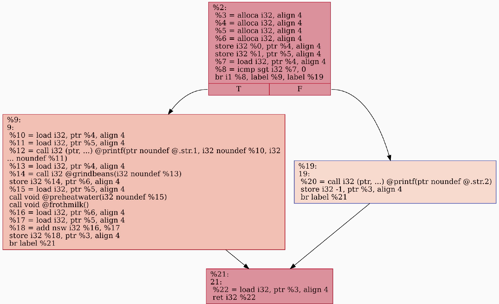
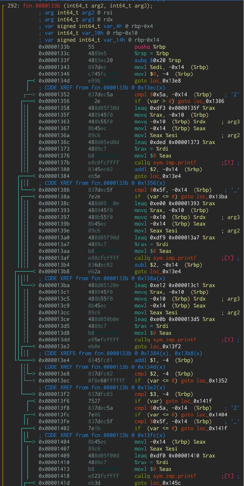
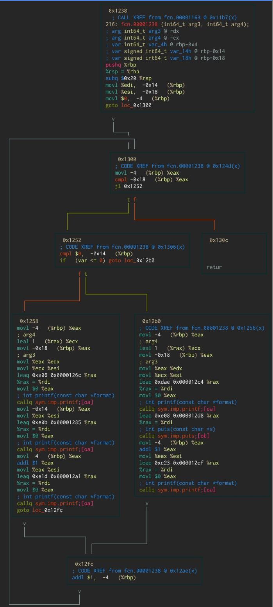
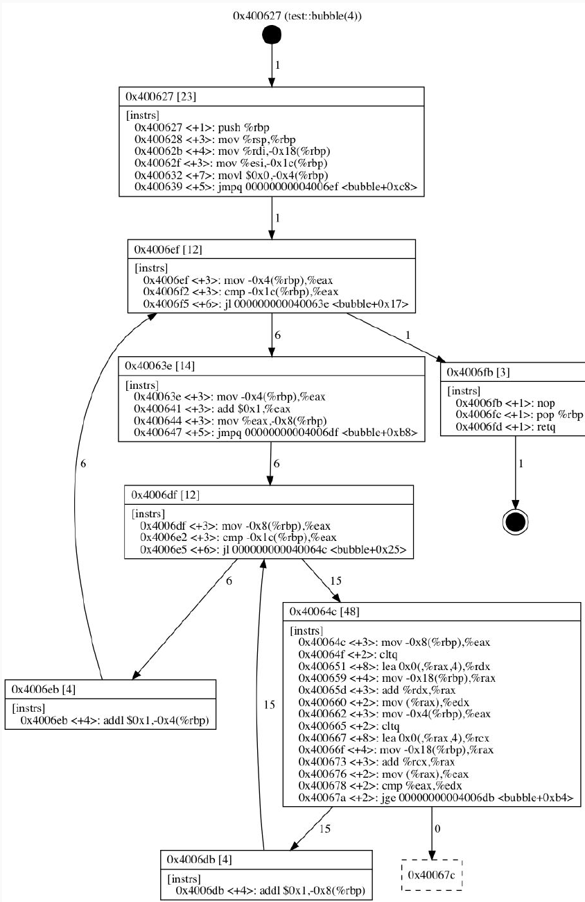
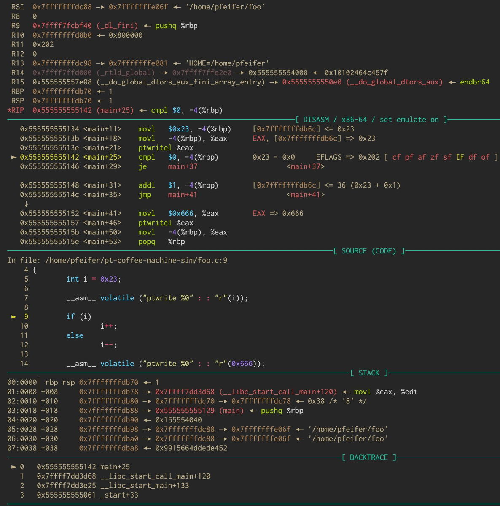
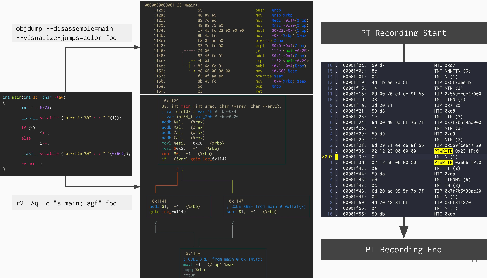
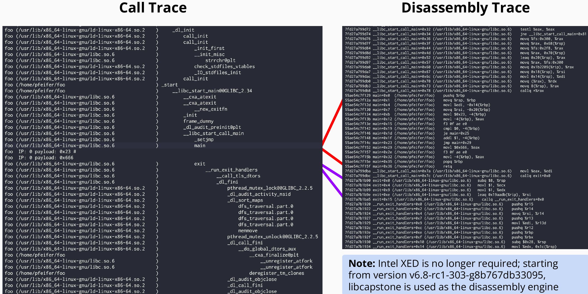

This blog-post demostrate how Intel Processor Trace (PT) can be usable for
everyday reverse-engineering and debugging tasks by showing exactly how to
capture and decode real execution, not just what the program *could* do in
theory. PT is powerful and surprisingly underused; once you see how to drive it
with `perf`, it becomes a reliable way to cut through indirection, obfuscation,
and environment-dependent behavior. 

# Agenda

We start with core notions of control-flow analysis, move to what Intel PT actually records, then work through a practical `perf` workflow, deal with common pitfalls, and close with limits and an appendix on correlating addresses under ASLR. 

# Control Flow Analysis: Concepts and Techniques

Before touching hardware, it pays to align on vocabulary. Static analysis reasons about code without running it; dynamic analysis watches code while it runs. A *basic block* is a straight-line instruction sequence with a single entry and exit; connect those blocks with directed edges for branches, calls, and returns and you get a control-flow graph (CFG). Add functions as nodes and call relations as edges and you have a call graph. Static approaches are great for intent and coverage; dynamic approaches tell you the truth about what actually happened on this run. 

[](93.png)

Static flow construction is a staple of reverse engineering. You disassemble, build CFGs, and analyze control structures and cross-references to understand program logic, identify key functions, and spot obfuscation. Tooling ranges from Ghidra, IDA, Binary Ninja, and Hopper to radare2/BinNavi/angr; use whatever fits your workflow. 

[](94.png)

Static control has hard limits. Some edges are inherently opaque without execution: indirect branches via registers or memory, JIT and self-modifying code, and data-driven dispatch. Dynamic analysis addresses that by running the program and observing real behavior. In practice, huge binaries execute only a small fraction of their `.text` on any given run, so tracing reality beats guessing possibilities. If you want brute-force path enumeration, there are tools like CFGgrind; for live call-graphing, Pin-based DCFG is handy; for classic step/debug, GDB (with pwndbg/gef) and radare2 cover the bases; if you need contained experiments, try Unicorn/QEMU.  

[](95.png)
[](96.png)

Modern binaries add layers of resistance: flow-flattening and virtualization, anti-debugging and anti-tamper checks, packers, self-modifying behavior, environment and VM detection. Intel PT doesn’t magically dissolve all of that, but it gives you high-fidelity control-flow capture that often breaks stalemates when static tools stall. 

[](97.png)

# What is Intel Processor Trace

Intel PT is a hardware facility that records control-flow decisions in a compact, low-overhead bitstream. It doesn’t sample; it streams branch outcomes, indirect targets, exceptions, and timing packets, then a decoder reconstructs the full instruction path from those breadcrumbs. Overhead is typically in the low single- to low double-digit percent range, and support exists on Intel CPUs since Broadwell. Despite heavy compression, data volume can still be large because modern code branches frequently.  


PT’s packet set is broader than most people expect. The essentials you will bump into are TNT (taken/not-taken bitsets that also cover returns), TIP (target IPs for indirect branches and exceptions), and time-related packets like CBR (core-bus ratio) and CYC (cycle counts). Configuration controls which classes appear in your stream, and newer microarchitectures added more timing detail. 

If you want a parallel static view while tracing, nothing stops you from generating a quick CFG or annotated disassembly for correlation. For example, a minimal static CFG from LLVM IR and a colored jump view from `objdump` are useful companions during PT work:  

```bash
clang -Xclang -disable-O0-optnone -emit-llvm -S -o f1.ll f1.c
opt f1.ll -passes=dot-cfg -cfg-dot-filename-prefix=f1 -disable-output

r2 -Aq -c 's main; agf' foo
objdump --disassemble=main --visualize-jumps=color foo
```

# Using perf with Intel PT for Control-Flow Analysis

`perf` is your workhorse: an in-kernel PM framework with a user-space tool that handles hardware counters, tracepoints, PMUs, and more. You can open PT as a PMU and record at process or system scope. The generic PMU syntax looks like `pmu/config=M,config1=N,config3=K/`; for PT, you enable features like PTWRITE and CYC and pick a cycle threshold that balances fidelity and volume.  

[](98.png)

```bash
# Generic PMU form
perf record --event pmu/config=M,config1=N,config3=K/ -- <workload>

# Intel PT user-space capture with PTWRITE + CYC and a moderate cycle threshold
perf record -e intel_pt/ptw,cyc,cyc_thresh=5/u -o perf.data -- ./foo
```

Decoding is where PT pays for itself. Start with a coarse call-oriented view to get your bearings, then zoom into reconstructed assembly where needed. `perf script --call-trace` gives a compact call/return narrative; `--insn-trace=disasm` reconstructs the instruction stream. When correlating runtime addresses and files under ASLR, dump `mmap` events; to inspect what the decoder actually saw, dump raw PT. Branch-focused and power/decoder debugging modes exist for deeper dives. Since `perf` v6.8-rc1-303-g8b767db33095, Capstone is the default disassembler, so Intel XED isn’t required on new builds.  

```bash
# High-level call view
perf script --call-trace --ns -F -cpu,-tid,-time

# Reconstructed instruction stream
perf script --insn-trace=disasm -F -cpu,-tid,-time

# Useful helpers
perf script --dump-raw-trace
perf script --no-itrace --show-mmap-events
perf script --itrace=iybxwpe -F+flags
perf script --itrace=p
perf script --itrace=d
```

[](99.png)

At some point you will want custom post-processing. You can parse `perf script` text, but for serious work plug in via a dlfilter and operate on decoded samples directly. The minimal skeleton below prints instruction pointers; extend it with symbolization, range filters, PTWRITE tags, or custom export. 

```c
// filter.c
#include <inttypes.h>
#include <stdio.h>
int filter_event(void *data, const struct perf_dlfilter_sample *sample, void *ctx)
{
    if (sample->ip) {
        printf("IP: 0x%" PRIx64 "\n", sample->ip);
    }
    return 0;
}
```

```bash
gcc -o filter.so -shared -fPIC filter.c -ldl
perf script --dlfilter=filter.so
```

To keep recordings focused, filter by instruction pointer ranges or symbols so you trace only what matters. If opaque returns impede analysis, disable return compression to see every `ret`. Scope recording by PID or CPU, or switch to snapshot mode to bound volume. If you don’t need tight timing, raise `cyc_thresh`. PTWRITE is handy for ground-truth markers, and on systems that support it you can pair PT with PEBS to combine control- and data-side views—just be aware that mixing tracing and sampling complicates workflows.   

```bash
# Examples
perf record -e intel_pt//u --filter 'start 0x1149 @ foo' -- ./foo
perf record -e intel_pt//u --filter 'filter main @ foo' -- ./foo
perf record -e intel_pt/noretcomp/u -- ./foo
```

Two practical realities: decoding is compute-heavy, and reports explode if you dump everything. Even a 10 ms system-wide capture on a 32-core box can produce megabytes of raw data and hundreds of megabytes of decoded text. Slice decoding with `--time <start>,<stop>`, drop unneeded fields, and increase buffers or narrow scope if you see record overruns.  

```bash
perf record -a -e intel_pt// -o perf.data -- sleep 0.01
perf script --itrace=i0ns --ns > report.txt
ls -lh report.txt perf.data
```

# Limitations of Intel PT in Control-Flow Analysis

PT captures metadata about control-flow decisions and reconstructs your path from that; it does not capture the executed instruction bytes. If the image on disk doesn’t match what ran—JIT output, self-modifying segments, injected code—the decoder will stumble because its ground truth is wrong. PT also doesn’t give you data flow; combine with other techniques if you need memory semantics. Finally, while overhead is modest, data volume is real, so filtering and scoped decoding are part of normal operations. On other architectures: ARM’s counterpart is CoreSight ETM with different semantics, and there is no direct AMD equivalent—use Intel CPUs for PT. 

# Appendix: Correlate Dynamically Mapped DSOs

Under ASLR, raw addresses are meaningless until you anchor them to mappings. Fortunately, `perf` records `mmap` events. Dump those, then compute file offsets with a simple formula: `file_offset = runtime_address - segment_start + file_mapping_offset`. With that offset, you can jump straight to the correct bytes in the ELF and line it up with your PT-reconstructed path.  

```bash
perf script --no-itrace --show-mmap-events
# file_offset = [address] - start + offset
# example:
# 4769 = 0x5583ca2fa2a1 - 0x5583ca2fa000 + 0x1000
```

# Closing and Contact

That’s the workflow I use in practice: record narrowly, decode with intent, and only escalate complexity when the trace suggests it. If you want a minimal repo with ready-made scripts and a dlfilter scaffold, tell me what target you have in mind and I’ll produce one based on the commands above. For questions, reach out at [hagen@jauu.net](mailto:hagen@jauu.net). 

---

Copyright © 2024 Hagen Paul Pfeifer. This work is licensed under CC BY-NC 4.0. Redistribution encouraged. Not for use in AI/LLM training or commercial applications. 
