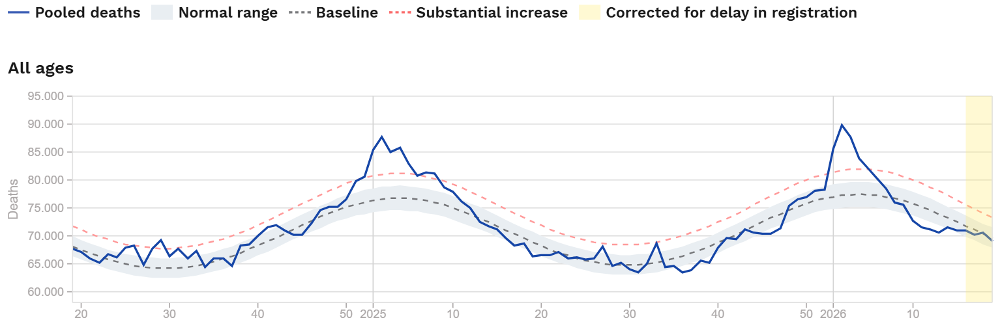
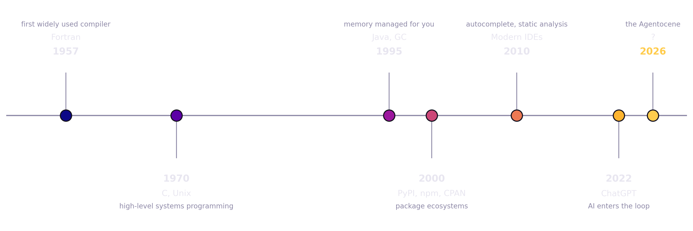
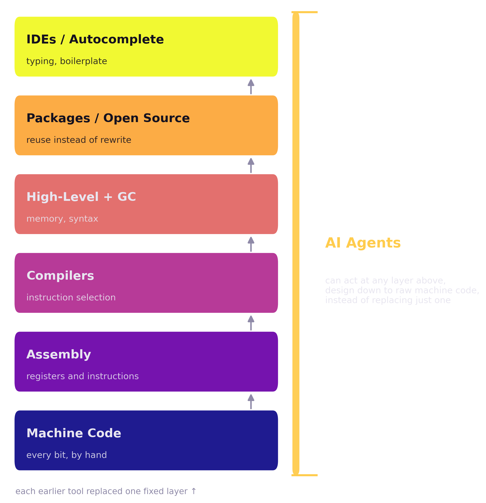
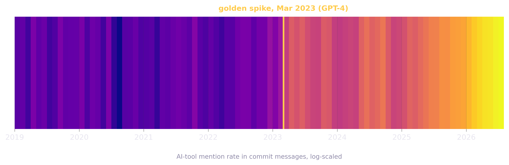
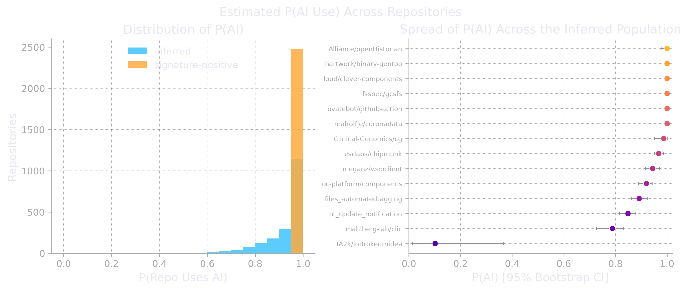
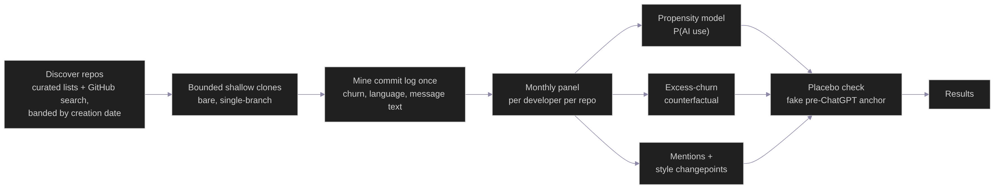
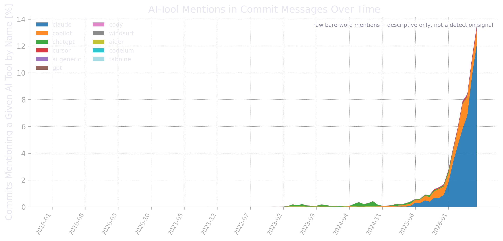
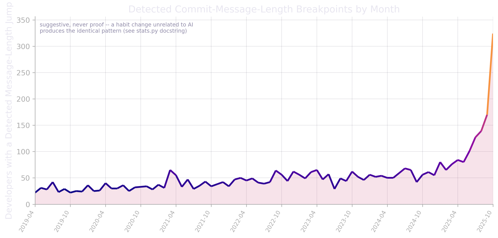
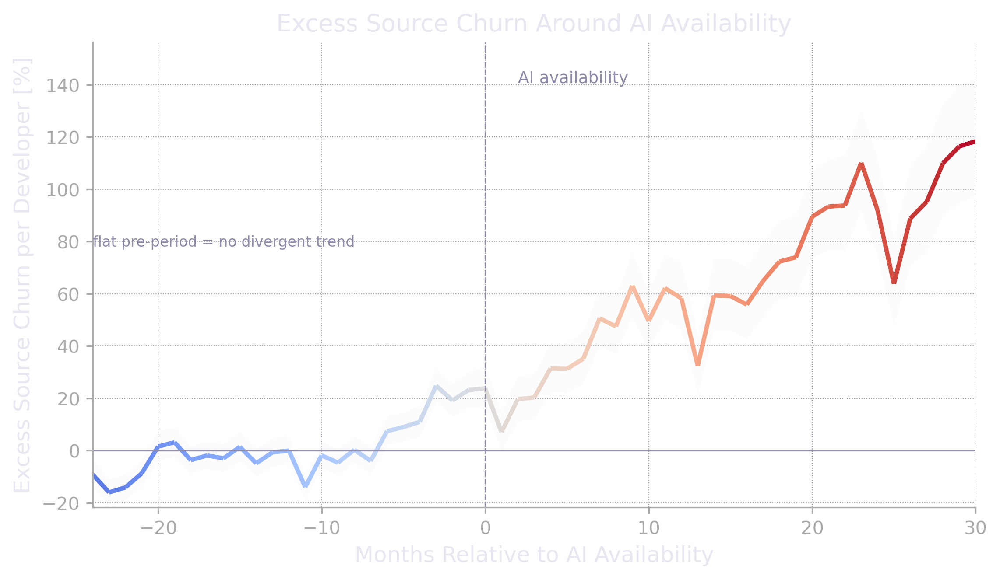
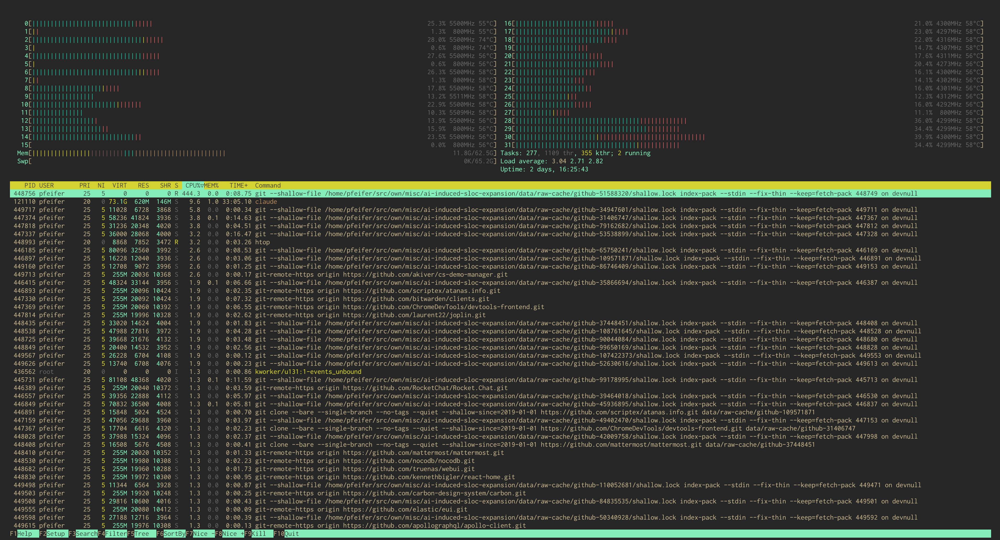

## TL;DR

- This started as a search for KPI differences from AI adoption. That led
  to a more basic question first: can a shift like this be proven
  statistically at all?
- Software keeps handing more work to the machine: compilers, libraries,
  autocomplete. AI is the next step, and this time it shows up in the data,
  not just in opinions.
- I mined 5,009 git repositories (Rust, Python, JavaScript, TypeScript, commit
  history from 2019 through mid-2026) and tracked 10,812 individual
  developers to look for a measurable trace of that shift.
- It's there, from two signals that agree with each other independently.
  Literal AI-tool mentions in commit messages went from essentially zero to
  1 in 8 commits by July 2026. A much harder-to-fake signal, a sudden,
  lasting jump in how long people's commit messages get, shows the same
  accelerating curve for 15% of the developers with enough history to check.
- Whether this is already producing more code, not just different-looking
  commits, is a separate and harder question. My data doesn't answer it
  cleanly yet, and I say so plainly further down.
- This new era is already being called the Agentocene: agents do the work,
  we no longer code by hand.

## A Lesson from Epidemiology

In June 2026, Europe was hit by a heat wave unlike any on record. The
question everyone asked: how many people died because of it?

That's where epidemiology runs into a familiar wall. For any single death,
it's nearly impossible to prove that heat was the cause. The death
certificate says heart failure, not 42 degrees.

The proof doesn't need single cases, though. Statistics answers the question
with excess mortality: you compare the observed number of deaths against the
number you'd expect from previous years. When mortality climbs far above
that baseline, the heat has left its mark, no individual attribution
required.

[EuroMOMO](https://euromomo.eu/bulletins/2026-19), the European mortality
monitoring network, publishes exactly this comparison every week: observed
deaths against an expected baseline and its normal range, pooled across 25
countries. The gap between the line and the band is the excess, no autopsy
needed for any single death in it.

[](euromomo-excess-mortality-bulletin.png)

I used the same principle to test for the Agentocene, the era in which AI
agents write our code. Look at a single commit and you can rarely prove an
AI produced it. Commits carry no reliable label, and AI-text detectors don't
work reliably on prose, let alone on code. But if AI agents really changed
how software gets written, that change has to surface as a structural
deviation in the aggregate data of many repositories, the same way a heat
wave surfaces in death counts, not in any one obituary. This post is about
finding that deviation.

## A Short History of Not Writing Code

Software has always been a story of programmers handing work to machines.
In the early decades, writing directly in assembly was the only option, and
every instruction, every register, was a manual decision made by a person.
Adding two numbers and printing the result took real work:

```nasm
; x86 Linux syscalls: compute 5 + 7 and print the result
section .data
    a       dd 5
    b       dd 7
    buffer  db 10 dup(0)

section .text
    global _start
_start:
    mov eax, [a]
    add eax, [b]            ; eax = 12

    mov ecx, buffer + 9      ; convert eax to ASCII, back to front
    mov ebx, 10
.convert:
    xor edx, edx
    div ebx
    add edx, '0'
    mov [ecx], dl
    dec ecx
    test eax, eax
    jnz .convert
    inc ecx

    mov edx, buffer + 10 - ecx
    mov eax, 4                ; sys_write
    mov ebx, 1                ; stdout
    int 0x80

    mov eax, 1                 ; sys_exit
    int 0x80
```

Twenty-some lines, and I still glossed over register allocation and the
calling convention. Here's the same thing after a few decades of delegation:

```python
print(5 + 7)
```

Then came compilers, and plenty of programmers hated the idea. Trusting a
machine to decide which instructions to emit felt like giving up precision,
maybe giving up craft altogether.

It's worth remembering how big that jump actually was, and it happened to
come up again very recently. In May 2026, at the Open Source Summit in
Minneapolis, Linus Torvalds made almost exactly this point while pushing
back on claims that "99% of our code is AI-written" now circulating in
parts of the industry. As [LWN reported](https://lwn.net/Articles/1073761/),
his comparison was blunt: compilers increased programmer productivity by
something like a factor of a thousand. AI, in his estimate, adds maybe
another factor of ten on top of that. He wasn't dismissing AI: he pointed
out that Linux kernel submissions had climbed roughly 20% over the prior six
months, and he credited better AI tooling with lowering the barrier to
writing a decent kernel patch. His point was about scale, not existence.
Compilers were the bigger revolution, and nobody today calls a compiler a
co-author.

[](history-timeline-dark.png)

After compilers came high-level languages and garbage collection, another
vote to trade raw machine efficiency for less time spent on bookkeeping a
human doesn't need to do by hand. Then package ecosystems arrived, and at
some point most of us stopped writing what we could just `npm install` or
`pip install` instead. Then IDEs, autocompletion, static analysis, linters
that flag a bug before you've finished typing the line.

Every one of these steps had its critics at the time. Real programmers
don't need a debugger. Real programmers write their own hash table. Each
delegation looked, in the moment, like it might be the one that finally
goes too far. None of them did. Programmers kept programming, just at a
different layer, further from the machine and closer to the problem.

AI-assisted coding doesn't slot neatly into this stack as just the next
rung, though. Every earlier delegation replaced one specific layer: a
compiler replaced instruction selection, a garbage collector replaced
memory bookkeeping, a package manager replaced rewriting what already
exists. Each tool did its one job and left the rest of the stack alone. AI
can work at any of those layers, or all of them at once. Ask it to write
assembly and it will. Ask it to skip straight to machine code and it can do
that too, badly and wastefully, but it can. Nothing before it could
collapse the entire stack like that.

That's why I'd call this the biggest change in how software gets built
since programming began, bigger than compilers, bigger than open source.
The clearest evidence isn't in git history at all. It's in who is shipping
software now: people who never learned to program are already building
working, sometimes large, software projects end to end. The statistics in
this post are one way to measure the shift. That's another, and it's
already visible.

[](abstraction-ladder-dark.png)

## Naming the Epoch: The Agentocene

Geologists have a formal process for declaring a new epoch. They look for a
golden spike, officially a Global Boundary Stratotype Section and Point: a
single, physical, measurable marker in the rock that lets you point at a
layer and say, here, this is where the old epoch ends. The proposed marker
for the Anthropocene, the epoch defined by human impact on the planet, is a
thin band of plutonium isotopes from mid-20th-century nuclear tests,
deposited into sediment worldwide within the span of a few years.

I want to borrow that idea for software, not just the name. If AI-assisted
coding really marks a new era, the same logic should apply: there ought to
be a golden spike somewhere in the historical record of how software gets
built. Not an opinion, not a vibe. A measurable deviation in the sediment.

Our sediment is git history: millions of commits, timestamped, diffed,
attributable down to the month. If the Agentocene, the era where agents do
the writing and we do the deciding, has actually begun, it has to leave a
trace in that record the same way plutonium left a trace in ocean mud. This
post is my attempt to find that trace.

I drew my own core sample to check. The strip below is the AI-tool mention
rate from the dataset described further down, plotted like a drilled core,
oldest at the bottom, most recent at the top, color-coded on a log scale so
the near-zero years read as one uniform layer. The color visibly changes
in March 2023, the month GPT-4 shipped, and never goes back.

[](git-history-sediment-core-dark.png)

## The Question: Is It Measurable?

Ask around and everyone has an opinion. Developers say AI either makes them
dramatically faster or mostly gets in the way, sometimes in the same
conversation. Surveys ask people how much they think AI helped, which
mostly measures how people feel about AI, not what actually changed in the
code they shipped.

I wanted different evidence: not what people say about AI, but what shows
up, unprompted, in the repositories they actually work in. That means going
to the source, git history at scale, and looking for a pattern that
couldn't easily exist by coincidence.

## Method: How I Analyzed 5,009 Repositories

The tempting design is simple: average lines of code per week before
ChatGPT, average it again after, compare. It doesn't survive scrutiny.
There's no control group, since essentially every developer got exposed to
AI tools around the same time, so any coincident trend, more remote work,
better tooling in general, repos simply growing older, gets tangled up with
"AI". Adoption itself is unobservable at scale: trailers like
`Co-Authored-By: Claude` get stripped by squashing, rebasing, pre-commit
hooks, or plain opt-out, so their absence tells you nothing. Lines of code
is a mediocre productivity metric on its own, since more lines can mean
bloat or generated boilerplate just as easily as useful work. And repos
still alive in 2026 are not a random sample of repos that existed in 2020;
the dead ones already dropped out of the picture.

So the design I actually used looks different:

- **Dataset**: 5,009 repositories across four languages, Rust, Python,
  JavaScript, and TypeScript, mixing curated lists of well-known, long-lived
  projects with a systematic GitHub search, every repo required to show
  real, recent commit activity to qualify, no dead projects included
- **Time range**: full commit history from January 2019 through mid-2026,
  91 months, anchored on November 2022, the month ChatGPT shipped, as the
  dividing line between "before" and "after"
- **Continuity filter**: 2,084 of the 5,009 repositories had commit history
  clean enough, no long gaps, activity on both sides of the anchor, to
  support a proper before/after comparison. The rest were either too young,
  had gone dormant, or had gaps in the record, and were tracked separately
  rather than silently dropped
- **Unit of analysis**: individual developers, not whole repositories. A
  repo's average output can shift just because the team got bigger or
  smaller, which has nothing to do with AI. An individual's own trend over
  time can't lie to you the same way. Across the 2,084 included
  repositories, that's 10,812 developer histories
- **Signals**, since disclosure can't be trusted, a battery of indirect
  measurements instead of one "AI used here" label:
  - each developer's own code-churn trend, extrapolated forward and
    compared against what actually happened afterward (an excess-churn
    design, borrowed from the same logic as excess mortality)
  - a calibrated model estimating each developer's probability of AI use,
    trained on the rare cases where a genuine, if noisy, label exists (the
    chart below shows the resulting distribution)
  - two signals that don't rely on anyone disclosing anything at all:
    literal AI-tool mentions in commit text, and a search for sudden,
    lasting shifts in how people write their commit messages. These carry
    the headline results further down, built deliberately separate from
    everything else, more on why in a moment

[](fig-propensity-dark.png)

The pipeline runs in six steps, from raw clone to checked result:

[](analysis-pipeline-dark.png)

The full statistical machinery behind each step, including the placebo and
permutation checks that keep it honest, is in Implementation Aspects below.

## Results

### Finding 1: AI Tools Went from Unmentioned to Unmissable

The most direct signal is also the simplest: how often do commit messages
name an AI tool by name? Claude, Copilot, ChatGPT, Cursor, and a handful of
others. I counted a bare mention only when it wasn't just an ordinary word
doing something else (an early version of this counted "cursor" as an
AI-tool mention in a 2019 commit about terminal cursor positioning, which
it obviously wasn't, so ambiguous terms now need a nearby AI-related word
to count).

[](fig-mentions-timeseries-dark.png)

The line sits at essentially zero until early 2023, creeps up through 2024,
and then breaks upward hard through 2025 and into 2026: 8.4% of commits in
May 2026, 11.1% in June, 13.5% in July. One in eight commits, by name, in
the most recent month I have data for. Claude alone accounts for most of
the recent growth in this sample, though that's a property of which
projects and languages I sampled, not a universal claim about market share.

This is descriptive, not a detection method. It says nothing about the 7 in
8 commits that don't mention a tool. Some of those were written entirely by
hand; some had AI help nobody bothered to mention. Which is exactly why I
didn't stop here.

### Finding 2: An Involuntary Signal Says the Same Thing

Here's one of my own commits from 2014:

```
commit f8c298e29669655b9eb47d5d14ffb32476390c54
Author: Hagen Paul Pfeifer <hagen@jauu.net>
Date:   Tue Dec 30 16:11:02 2014 +0100

    stack: handle rsp mangling via %r11

    Signed-off-by: Hagen Paul Pfeifer <hagen@jauu.net>
```

And here's one from July 2026:

```
commit 5da5525e17085fe740b87294e20af02baf704bd3
Author: Hagen Paul Pfeifer <hagen@jauu.net>
Date:   Sat Jul 4 16:08:00 2026 +0200

    core: title case labels and description sidecars

    All axis labels, legends and proportion captions use title case now
    (Function Size [Byte] instead of function size [byte]).

    Every rendered graph is accompanied by a <name>.png.txt sidecar: one
    sentence what the picture shows, then a longer paragraph what can be
    read from it and what it is useful for. Handy when the PNGs end up
    in slides or a wiki and the context of the analyzer run is gone. The
    sidecar files are reported on stderr next to the graph files.

    Signed-off-by: Hagen Paul Pfeifer <hagen@jauu.net>
```

I noticed my own commit messages had quietly gotten much longer and more
structured, and it wasn't a gradual drift, it was a step change. That's
worth noticing precisely because it isn't something people tend to hide.
Someone who deliberately skips a `Co-Authored-By` trailer to avoid flagging
AI use, which some people do on purpose, is very unlikely to also go back
and rewrite their own writing habits to look the way they used to. The
disclosure gets sanitized. The style, usually, doesn't.

So I searched every developer's monthly commit-message length for the same
kind of step change: not a fixed before/after comparison, but the single
point in each person's own history that best splits it into a shorter-message
era and a longer-message era. Naively, searching for the best possible split
point is a biased method. Given enough months of pure noise, some split
will look dramatic purely by chance, so I tested every candidate jump
against a reshuffled version of that same person's own data, and only
counted a jump as real if it beat that noise floor.

[](fig-style-changepoints-dark.png)

4,214 of the 27,679 developers with enough history to test, about 15%,
show a jump that clears that bar. The chart above shows when those jumps
happened, and the shape matches the mentions curve almost exactly: flat for
years, then a rising curve that steepens through 2024 and 2025. Two signals,
built from completely different data, built to not depend on each other,
landing on the same timeline. That's the closest thing I have to a golden
spike.

### Finding 3: Does It Mean More Code? Not Provably, Not Yet

The natural next question is whether any of this shows up as more code
getting shipped. I looked, using the excess-churn design: fit each
developer's or repository's own pre-2022 trend, extrapolate it forward, and
measure the gap between that extrapolation and what actually happened.

[](fig-event-study-dark.png)

At the repository level, this looks like a smoking gun: churn climbs to
well over 100% above the extrapolated baseline within two years. I don't
trust that number, and I want to say so before anyone else has to point it
out. Repositories change size and shape for reasons that have nothing to do
with AI: teams grow, projects mature, dependencies get vendored in. When I
ran the same analysis with a fake anchor date set years before ChatGPT
existed, a large chunk of that same climb showed up anyway, which means a
meaningful part of it is a generic growth trend, not an AI effect.

The individual-developer version of the same design, which sidesteps the
team-size problem by construction, tells a more modest and more honest
story: -11.9% excess churn against a -6.0% placebo. Those two numbers are
close enough that I can't confidently say AI use is currently producing
more raw code output per developer, at this sample size, with this method.
It might be true. It might resolve differently with more repositories or a
longer post-period. Right now, it's an open question, not a finding.

## Implementation Aspects

Cloning and mining 5,009 repositories is mostly an I/O and concurrency
problem, not a statistics problem:

- repos discovered via curated lists of well-known toolchains and
  frameworks, plus a systematic GitHub search banded by repository creation
  date, to route around the search API's 1,000-result cap and avoid
  over-sampling whatever happens to rank highest today
- every candidate had to pass a recent-activity check before it counted,
  so dormant repos never entered the pipeline in the first place
- each repo fetched as a bare, single-branch, shallow clone bounded to the
  analysis window: no working tree, no full history, no tags
- a resource governor watches disk, memory, and load in real time and
  throttles the number of concurrent clones accordingly, waiting for
  headroom instead of running the machine out of disk or falling over
  under load
- the whole run is resumable: kill it, restart it, and it picks up where
  it left off instead of re-cloning everything

The statistical side, so the path from raw commit to reported finding is
traceable end to end:

- **Excess-churn counterfactual**: for each developer (or repository), fit
  a trend on the pre-anchor months only (linear, plus a seasonal term for
  repos), extrapolate it forward, then compare the extrapolation against
  what actually happened. The gap is the "excess". Averaging happens in log
  space, since averaging raw percentages first would inject a bias that
  makes even pure noise look like growth
- **Propensity model**: a calibrated estimate of each developer's P(AI use),
  trained on positive-unlabeled data, meaning only some true positives are
  known (the rare, genuine signature hits) and everyone else is unlabeled,
  not confirmed negative. Calibration uses a bootstrap correction so the
  scores stay honest about that asymmetry
- **Placebo test**: rerun the entire analysis with a fake "AI availability"
  date set years before ChatGPT existed. Anything that shows up at the fake
  date too is a generic trend, not an AI effect, and gets reported as such
  instead of as a finding. This caught real bugs during development, not
  just theoretical ones
- **Permutation test on the style-changepoint search**: searching for the
  single best split point in a noisy series is a biased method by itself,
  since some split will look dramatic purely by chance given enough months.
  Each developer's detected jump is checked against many reshuffles of
  their own data, and only counted as real if it beats that noise floor
- **Right-censoring trim**: every developer's history happens to end around
  the same real-world data-gathering date. Left unadjusted, that shared
  edge fakes a cluster of "recent" changepoints on its own, since a short
  trailing window is noisier and easier to mistake for a jump. Fixed by
  trimming the most recent shared months out of the changepoint search
  entirely, rather than trusting the raw result

[](htop-usage-analysis-during-git-data-gathering.png)

## Limitations

This analysis leans on public GitHub repositories in four popular,
professionally maintained language ecosystems. It says little about
private codebases, internal enterprise repos, or languages and communities
outside that sample, and repositories still active in 2026 are not a random
draw from everything that existed in 2019: the ones that died along the way
already dropped out of view.

The two headline signals are proxies, not proof. A mention of an AI tool in
a commit message tells you someone talked about the tool, not how much it
actually contributed to the diff. A jump in message length is suggestive of
a changed workflow, but a new job, a team adopting a commit style guide, or
someone simply becoming a more thorough writer over time would produce an
identical pattern. I can't fully separate those explanations from AI
adoption with the data I have, which is exactly why I built two independent
signals instead of trusting either one alone, and why I still call this
suggestive rather than conclusive.

The volume question in Finding 3 is the softest part of this whole post,
and deliberately so. Team-composition changes confound the repository-level
view, and the individual-level view isn't cleanly separated from noise yet.
I'd rather publish that honestly than dress up a placebo-contaminated
number as a headline.

## What This Means

Two ways to read this data, and I don't think the data itself can settle
which one is right:

- **Optimistic reading**: every past delegation step, compilers, garbage
  collection, package managers, IDEs, made software cheaper and more
  abundant, not programmers obsolete. AI is just the next entry on that
  list. The adoption curve I found is the normal shape of a new tool
  spreading from early adopters to everyone else, just faster because
  distribution itself is faster now.
- **More unsettled reading**: Torvalds' own point. Tools that speed up
  typing are one thing. Tools that start participating in decisions are
  another. That's a difference of degree that might turn into a difference
  of kind, and typing speed is not what my data measured.

What the data can confirm, regardless of which reading turns out right:

- Something real is happening, not just hype or survey noise.
- It's dated with reasonable confidence to an acceleration through 2024 and
  2025.
- Whether it changes who writes software, how much gets written, or what
  programmers spend their day doing, is still an open question, not a
  settled one.

Geologists needed decades after the first plutonium settled into sediment
before they agreed the Anthropocene was real, and they still argue about
exactly where its golden spike sits. I think we're at the equivalent of the
first sediment core for the Agentocene: the deviation is there, it's
measurable, and it's too early to know what it means once the layer
finishes settling.

> **Code**: the full pipeline behind this post, gathering, mining,
> statistics, and plots, is public:
> [github.com/hgn/statistical-investigation-agentocene](https://github.com/hgn/statistical-investigation-agentocene).
> Clone it, rerun the placebo checks yourself, point it at a different
> language or time window, or use it as a starting point for your own
> investigation. Issues and pull requests welcome.
